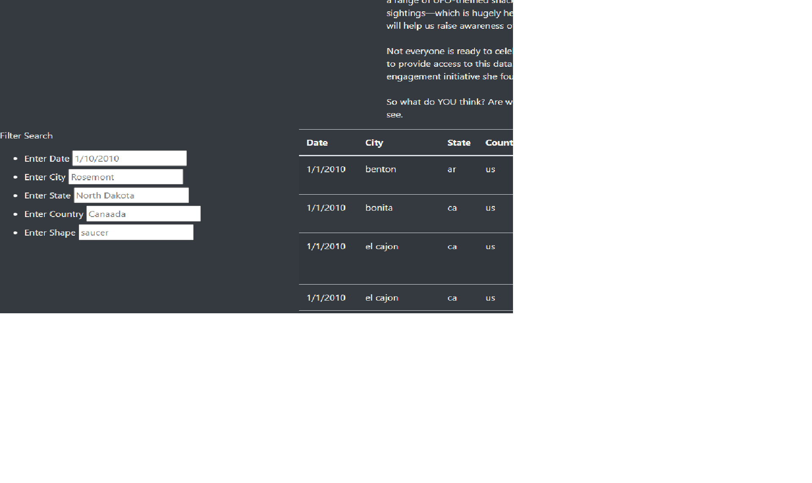

# ufo

## Overview 
    The goal of this project is to create an easily navigable application for filtering UFO data by date, city, state, country, and shape. To this end we created an html page backed with javascript and css coding. Bootstrap was used for the style elements to create a straightforward and easily navigable grid system.

## Results
The search is used by entering the desired filter into one of five search categories, Date, City, State, Country, or Shape. This then runs a loop through the data extracting the relavant entries. We then use 
'''
 function filterTable() {
  
    // 8. Set the filtered data to the tableData.
    let filteredData = tableData;
  
    // 9. Loop through all of the filters and keep any data that
    // matches the filter values
    Object.entries(searchFilters).forEach(([key, value]) => {
      filteredData = filteredData.filter(row => row[key] === value);
    });
  
    // 10. Finally, rebuild the table using the filtered data
    buildTable(filteredData);
  }
  ''' 
  to create the table that the user requested.  This allows the user to only focus on the data they need. 

## Summary
    This app creates a useful resource for narrowing down data but creates a fairly limited view of the ufo data. We have no access to who made these sightings and their overall veracity, although grouping by a single date is helpful for sorting this. Overall this is a solid research tool for starting a deeper dive in. 

  ### Reccomendations 
    To improve this tool I would reccomend adding a duration search filter to allow people searching to sort out the data further, i.e. I only want to see instances where the duration was over 5 minutes. I would also change the filters to not be case sensitive allowing a simpler functionality for users. 